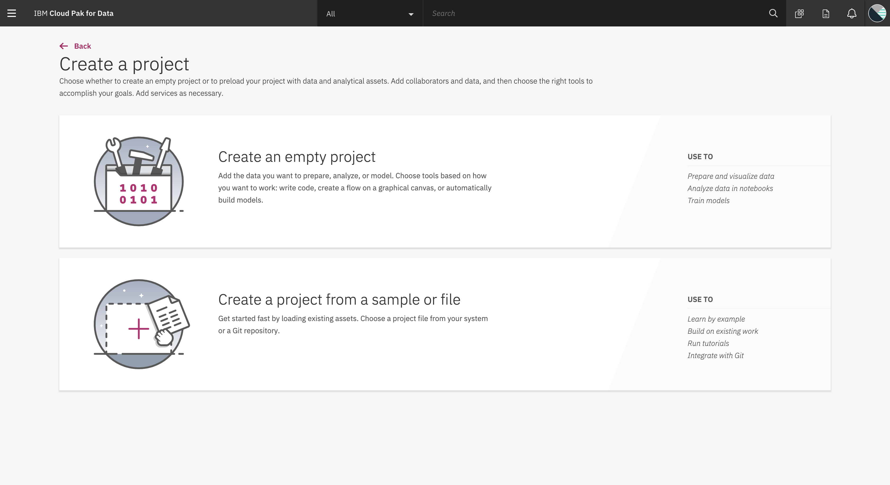
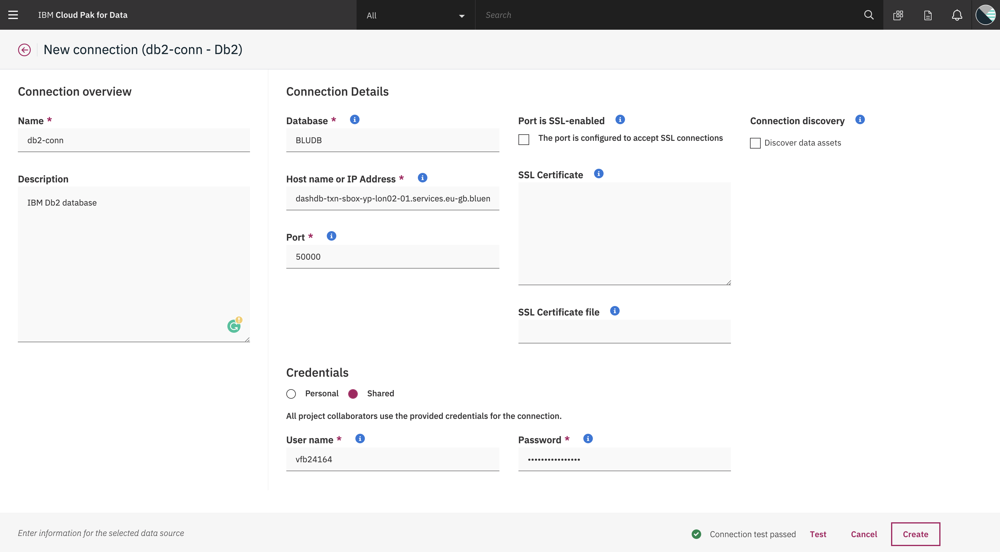
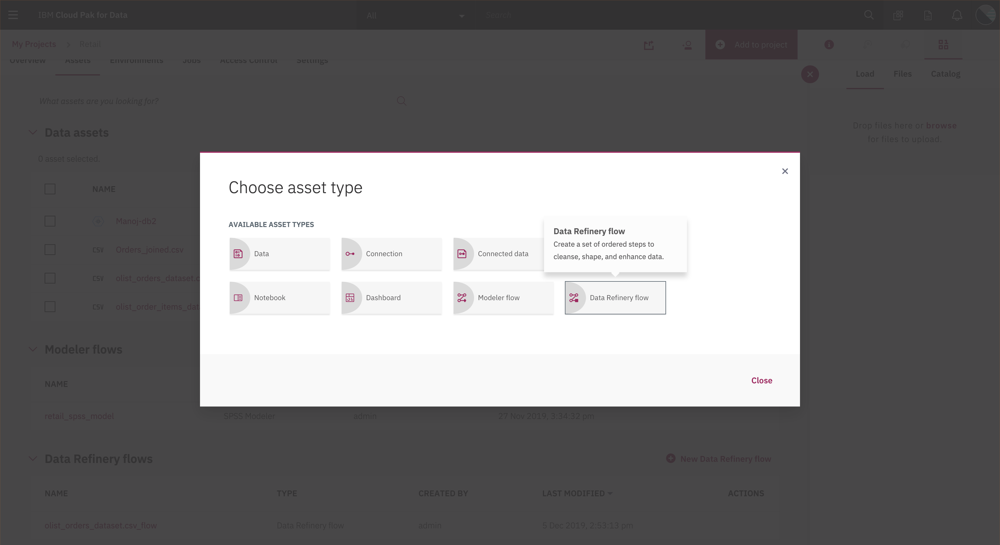
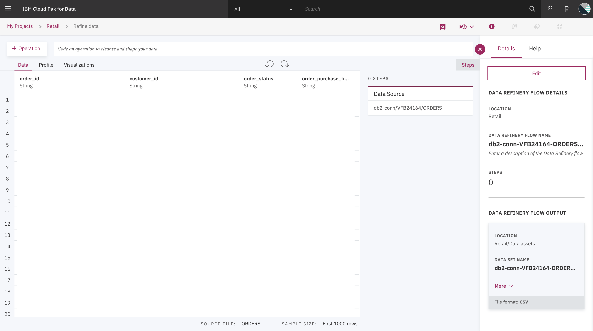
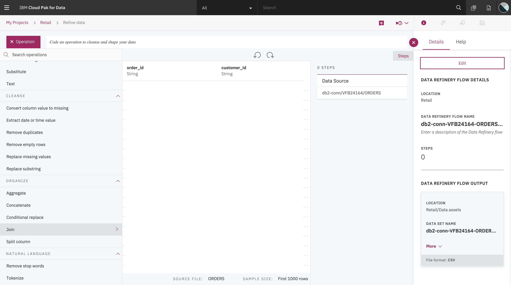
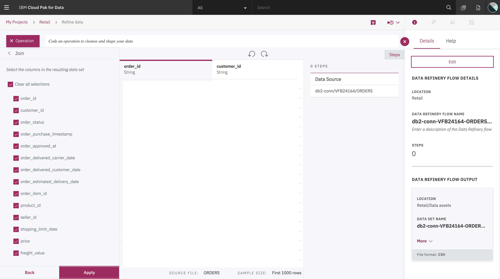
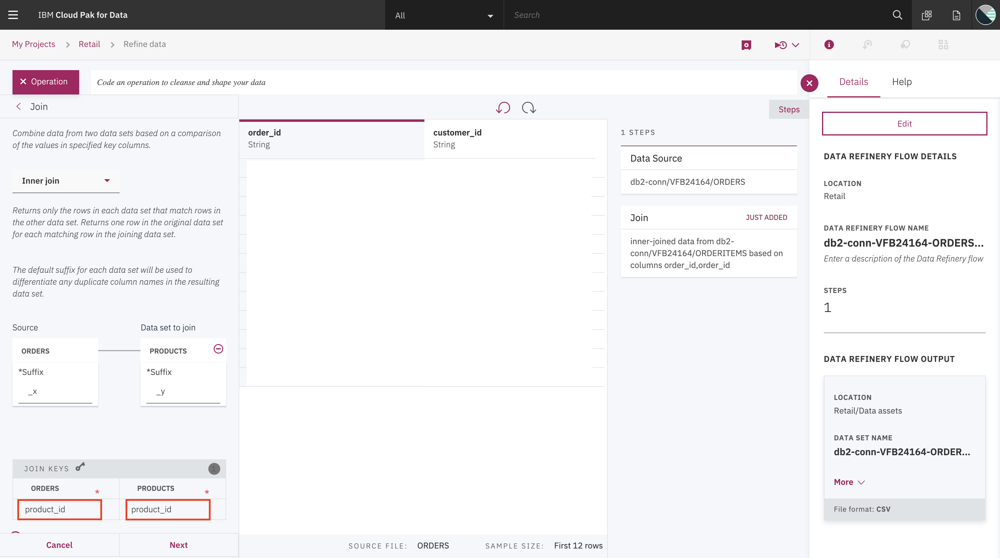
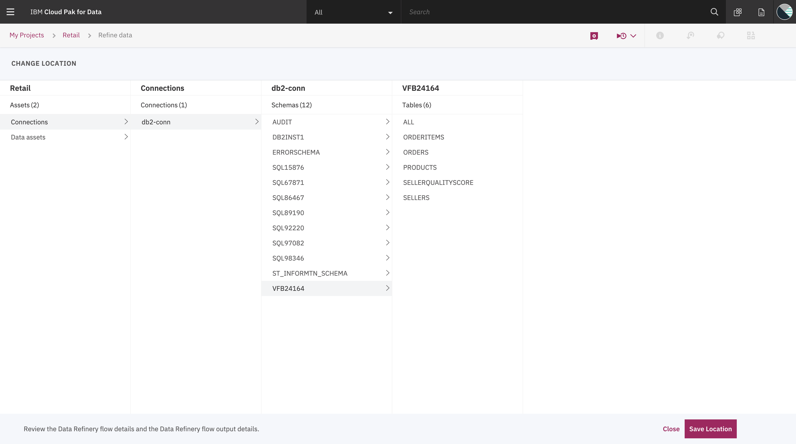
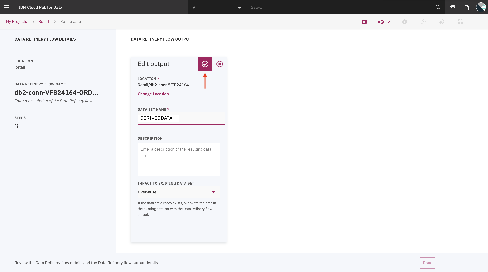
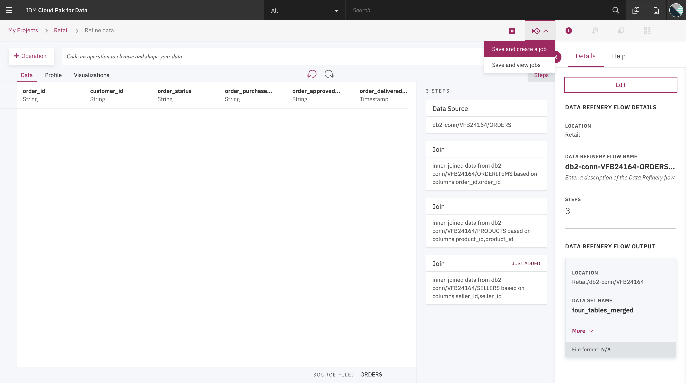

---
#Front matter (metadata).
abstract:               # REQUIRED

authors:
 - name: "Manoj Jahgirdar"
   email: "manoj.jahgirdar@in.ibm.com"
 - name: "Smruthi Raj Mohan"
   email: "smrraj32@in.ibm.com"
 - name: "Srikanth Manne"
   email: "srikanth.manne@in.ibm.com"
 - name: "Manjula G. Hosurmath"
   email: "mhosurma@in.ibm.com"

completed_date: 2020-01-20

components:
- slug: "ibm-db2-database"
  name: "IBM Db2 Database"
  url: "https://www.ibm.com/analytics/us/en/db2/"
  type: "component"
- slug: "cloud-pak-for-data"
  name: "IBM Cloud Pak for Data"
  url: "https://www.ibm.com/analytics/cloud-pak-for-data"
  type: "component"

draft: true|false       # REQUIRED

excerpt:                # REQUIRED

keywords:               # REQUIRED - comma separated list

last_updated:           # REQUIRED - Note: date format is YYYY-MM-DD

primary_tag:          # REQUIRED - Note: Choose only only one primary tag. Multiple primary tags will result in automation failure. Additional non-primary tags can be added below.

pta:                    # REQUIRED - Note: can be only one
# For a full list of options see https://github.ibm.com/IBMCode/Definitions/blob/master/primary-technology-area.yml
# Use the "slug" value found at the link above to include it in this content.
# Example (remove the # to uncomment):
 # - "cloud, container, and infrastructure"

pwg:                    # REQUIRED - Note: can be one or many
# For a full list of options see https://github.ibm.com/IBMCode/Definitions/blob/master/portfolio-working-group.yml
# Use the "slug" value found at the link above to include it in this content.
# Example (remove the # to uncomment):
# - "containers"

related_content:        # OPTIONAL - Note: zero or more related content
  - type: announcements|articles|blogs|patterns|series|tutorials|videos
    slug:

related_links:           # OPTIONAL - Note: zero or more related links
  - title:
    url:
    description:

runtimes:               # OPTIONAL - Note: Select runtimes from the complete set of runtimes below. Do not create new runtimes. Only use runtimes specifically in use by your content.
# For a full list of options see https://github.ibm.com/IBMCode/Definitions/blob/master/runtimes.yml
# Use the "slug" value found at the link above to include it in this content.
# Example (remove the # to uncomment):
 # - "asp.net 5"

series:                 # OPTIONAL
 - type:
   slug:

services:               # OPTIONAL - Note: please select services from the complete set of services below. Do not create new services. Only use services specifically in use by your content.
# For a full list of options see https://github.ibm.com/IBMCode/Definitions/blob/master/services.yml
# Use the "slug" value found at the link above to include it in this content.
# Example (remove the # to uncomment):
# - "blockchain"

subtitle:               # REQUIRED

tags:
# Please select tags from the complete set of tags below. Do not create new tags. Only use tags specifically targeted for your content. If your content could match all tags (for example cloud, hybrid, and on-prem) then do not tag it with those tags. Less is more.
# For a full list of options see https://github.ibm.com/IBMCode/Definitions/blob/master/tags.yml
# Use the "slug" value found at the link above to include it in this content.
# Example (remove the # to uncomment):
 # - "blockchain"

title:                  # REQUIRED

translators:             # OPTIONAL - Note: can be one or more
  - name:
    email:

type: tutorial

---

In this Tutorial, we will perform Data Engineering operations on multiple datasets using Watson Data Refinery on Cloud Pak for Data. 

A Data Scientist cannot directly build a model based on the dataset, the data collection and analysis is very essential before building a model. In this Tutorial we demonstrate how data scientists can easily collect data from databases, analyse the data and enhance the data according to their requirements with the help of Watson Data Refinery on Cloud Pak for Data.

## Learning objectives

When you have completed this code pattern, you will understand how to:

* Create a set of ordered steps to cleanse, shape, and enhance data. 
* Create a connection with any database and Data Refinery.
* Prepare datasets specific to your ML Model.
* Save the datasets in any database of your choice.

## Prerequisites

1. [Db2 on Cloud Pak for Data](https://www.ibm.com/support/producthub/icpdata/docs/content/SSQNUZ_current/cpd/svc/db2z/create_database_db2z.html) 

## Estimated time

Completing this tutorial should take about 30 minutes.

## Steps

### Step 1: Download the data

In this Tutorial we are going to use **Brazilian E-Commerce Public Dataset by Olist** from Kaggle. Download the dataset from the link given below.

* https://www.kaggle.com/olistbr/brazilian-ecommerce

After Downloading, Extract the `brazilian-ecommerce.zip` file.

We’ll be using the following files: 
1. [`brazilian-ecommerce/olist_orders_dataset.csv`]() : This is the core dataset. From each order you might find all other information.

2. [`brazilian-ecommerce/olist_order_items_dataset.csv`]() : This dataset includes data about the items purchased within each order.

3. [`brazilian-ecommerce/olist_products_dataset.csv`]() : This dataset includes data about the products sold by Olist.

4. [`brazilian-ecommerce/olist_sellers_dataset.csv`]() : This dataset includes data about the sellers that fulfilled orders made at Olist.

### Step 2: Load the data into tables in Db2
**NOTE: We are Assuming you have already Provisioned a Db2 Instance in your Cloud Pak for Data. If you do not have Db2 Instance Provisioned you can also use other on-prem, public or private Databases of your choice and load the datasets.**

* Open the Db2 Instance and click on load data.

* Select the **olist_orders_dataset.csv** file and select next.

* Choose your namespace and create a table named **ORDERS** and select next.

* You can preview the metadata of the table and select next.

* Click on **Begin Load** to import the downloaded `.csv` file into your Db2.

* Wait for the upload to finish and then you can add the other three datasets **olist_order_items_dataset.csv**, **olist_products_dataset.csv** & **olist_sellers_dataset.csv** in the similar way.

* Once the table is created, click on **Load More Data** to add the other three datasets.

* The Other three tables that we will be creating are **ORDERITEMS, PRODUCTS & SELLER** .

* Load the olist_order_items_dataset.csv, olist_products_dataset.csv & olist_sellers_dataset.csv by repeating the above steps.

### Step 3: Create a Project in Cloud Pak for Data

Once the Database is ready, we will start using the database in our Cloud Pak for Data. 

* Create a Project in Cloud Pak for Data choose an Empty Project.

* Once The Project is Created you will see the below page.

### Step 4: Add Db2 connection to the project

Now that we have created a project, we will start adding components to our project. We will start by adding Db2 Connection to our project first.

* Click on **Add to Project** and select **Connection**. If you have followed [step 2](#2-load-the-data-into-tables-in-db2) select **Db2** from the list and add the credentials of your provisioned Db2 Instance. If you have a different database then you can select that and fill in the credentials.

* After filling the credentials click on **Test Connection** to make sure you have entered correct credentials. Finally select **Create**.

### Step 5: Add Data Refinery to the project and perform Data Engineering Operations

#### 5.1 Add Data Refinery to the project

We will add Data Refinery Flow in the similar way.

* Click on **Add to Project** and select **Data Refinery Flow**. 

* Under *Assets* click on *Connections* and then click on the connection that you created in [step 4](#4-add-db2-connection-to-the-project), click on the schema of your Database and select the table **ORDERS** and finally click on ADD.

* You will now see the Data Refinery Dashboard.

#### 5.2 Add Data Refinery to the project

5.2.1 We will be performing the **Join** in this tutorial. Click on **Operation** on the top left and click on **Join**.

5.2.2 Select the **Inner Join** and add the second dataset from our db2 by clicking the button shown.

5.2.3 We will first join the ORDERS table with ORDERITEMS table from db2. Under *Assets* click on *Connections* and then click on the connection that you created in [step 4](#4-add-db2-connection-to-the-project), click on the schema of your Database and select the table **ORDERITEMS** and finally click on APPLY.

 

5.2.4 Select the **JOIN KEYS** for ORDERS and ORDERITEMS as **order_id** and click NEXT.

 

5.2.5 Click on *APPLY* to apply the Join Operation.

 

* Repeat the _steps 5.2.1_ to _step 5.2.5_ to add **PRODUCTS** and **SELLERS**.

* Select the **JOIN KEYS** for ORDERS and PRODUCTS as **product_id**.

* Select the **JOIN KEYS** for ORDERS and SELLERS as **seller_id**.

### Step 6: Save the Enhanced Dataset to a table in Db2 and Run the Job

Once the operations are performed its time to save the result in a table. By Default the resulting table will be saved as a `.csv` file in the project but we will change the output path to the Db2 database. 

#### 6.1 Save the Enhanced Dataset to a table in Db2

* Click on the **Edit** button on the top right as shown.

* Then click on the **Pencil button** as shown.

* Click on **Change Location**, under *Assets* click on *Connections* and then click on the connection that you created in [step 4](#4-add-db2-connection-to-the-project), click on the schema of your Database and finally click on **SAVE LOCATION**.

* Name the Dataset **four_tables_merged** and click on done.
 

#### 6.2 Run the Data Refinery Job

* Click on the **Save and create a Job** as shown.

* Give a name to the Job and finally click on **Create and Run**.

* The Job will start **running** and it will take approximately 4-5min to complete.

* Once The Job **Status** becomes **Completed**, you can check your database to see a new table with a name **four_tables_merged** with the result.

## Summary

A Data Scientist cannot directly build a model based on the dataset, the data collection and analysis is very essential before building a model. This tutorial allows Data Scientists to perform data engineering operations to any data easily hence reducing the time spent on a data engineering operation and Data Scientists can focus mainly on building a model. The main advantage of the Data Refinery capabilities of IBM Cloud Pak for Data is Creating a set of ordered steps to cleanse, shape, and enhance data.
