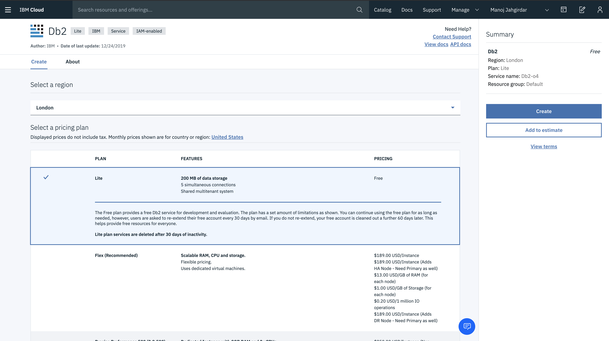
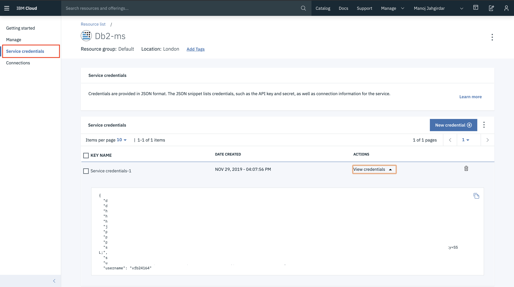
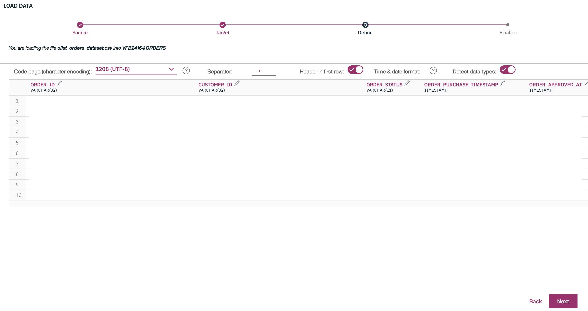
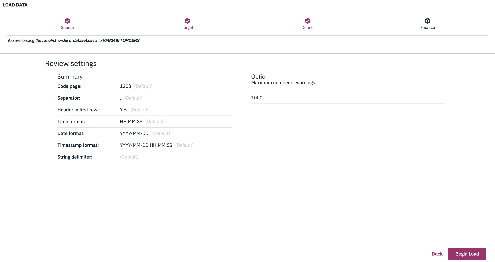
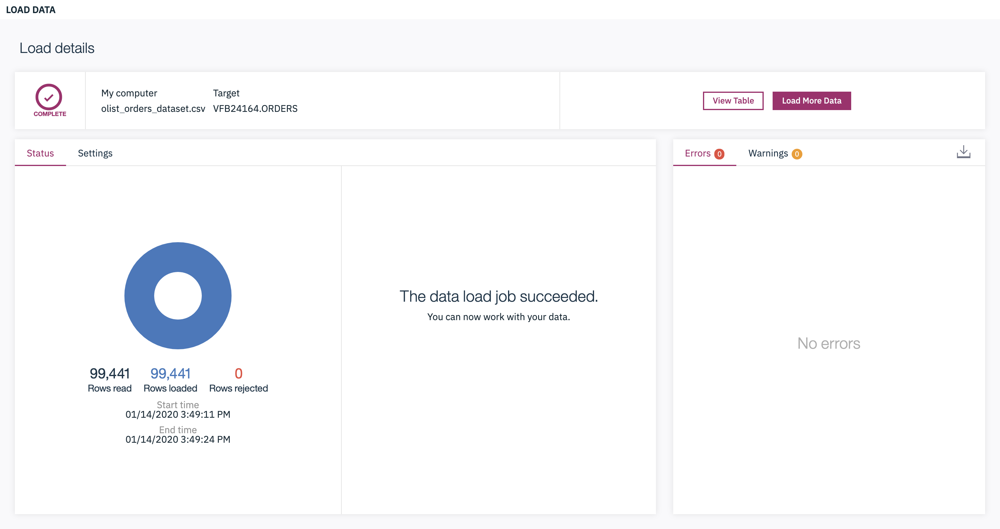
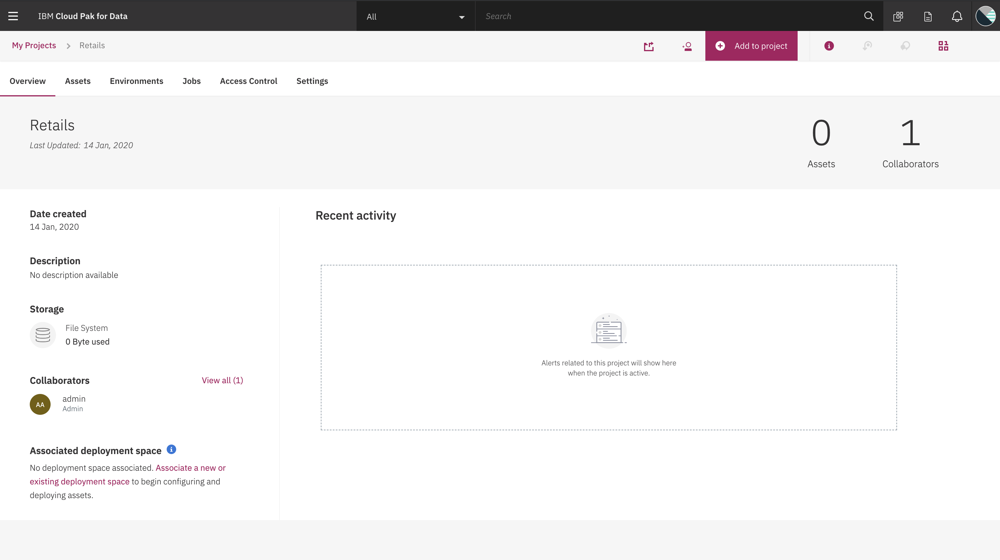
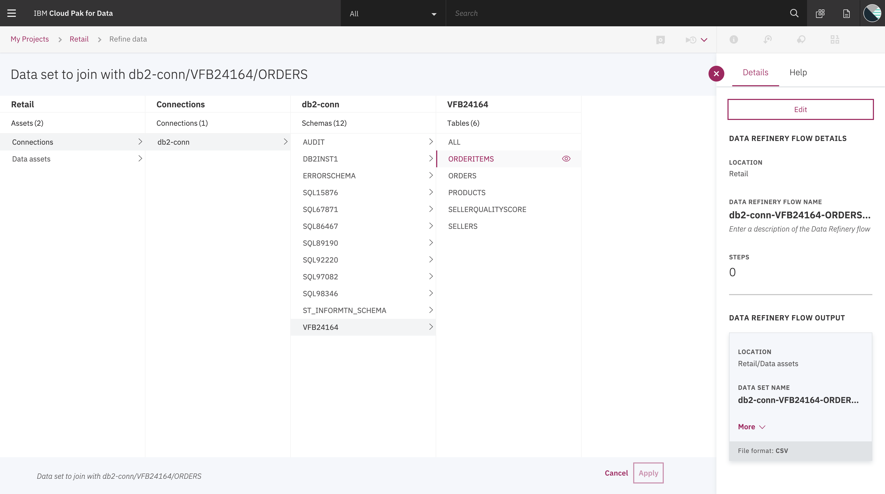
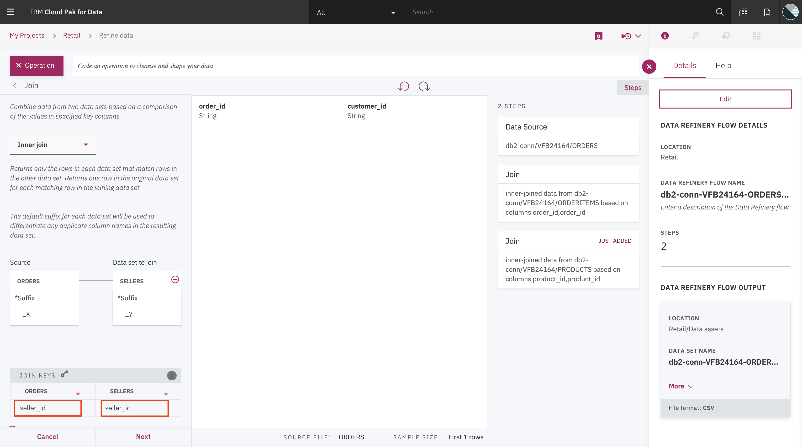
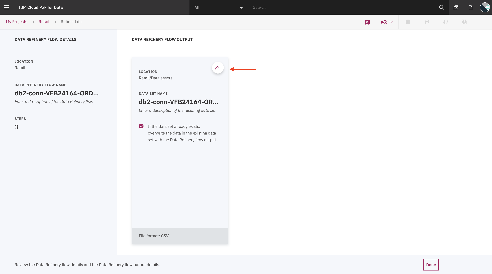
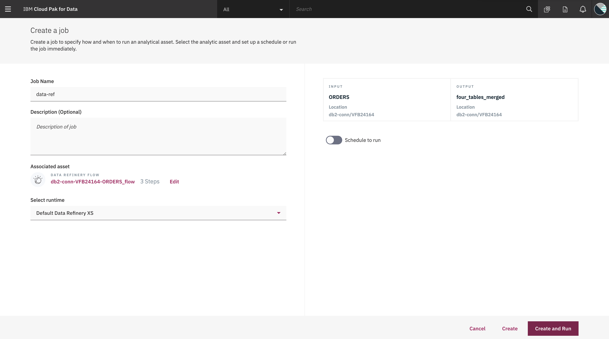

# Deploy on IBM Cloud

### Step 1: Download the data

In this Tutorial we are going to use **Brazilian E-Commerce Public Dataset by Olist** from Kaggle. Download the dataset from the link given below.

* https://www.kaggle.com/olistbr/brazilian-ecommerce

After Downloading, Extract the `brazilian-ecommerce.zip` file.

We’ll be using the following files: 
1. [`brazilian-ecommerce/olist_orders_dataset.csv`]() : This is the core dataset. From each order you might find all other information.

2. [`brazilian-ecommerce/olist_order_items_dataset.csv`]() : This dataset includes data about the items purchased within each order.

3. [`brazilian-ecommerce/olist_products_dataset.csv`]() : This dataset includes data about the products sold by Olist.

4. [`brazilian-ecommerce/olist_sellers_dataset.csv`]() : This dataset includes data about the sellers that fulfilled orders made at Olist. 

### Step 2: Load the data into tables in Db2

**NOTE: You can Skip this step if you do not want to use Db2 Instance as you can use other on-prem, public or private Databases of your choice and load the datasets.**

* Create a [Db2 Resource](https://cloud.ibm.com/catalog/services/db2).

* Once the Resource is ready click on **Service Credentials** on the left panel and then click **view credentials**.

**NOTE: Copy these credentials as it will be used in [Step 4](#-4-add-db2-connection-to-the-project).**

* Now click on **Manage** on the left panel and then click on **Open Console** to open the Db2 Console.

* Once the Db2 Console is opened, click on **load data.**

* Select the **olist_orders_dataset.csv** file and select next.

* Choose your namespace and create a table named **ORDERS** and select next.

**Note: Make sure you have selected the default schema of your database. In case of Db2 your default Schema is your username.**

* You can preview the metadata of the table and select next.

* Click on **Begin Load** to import the downloaded `.csv` file into your Db2.

* Wait for the upload to finish.

* Once the table is created, click on **Load More Data** to add the other three datasets.

* Load the `olist_order_items_dataset.csv` and name the table **ORDERITEMS**, load `olist_products_dataset.csv` and name the table **PRODUCTS** & finally load `olist_sellers_dataset.csv` and name the table **SELLERS** by repeating the above steps.

### Step 3: Create a Project in Cloud Pak for Data

Once the Database is ready, we will start using the database in our Cloud Pak for Data. 

* Create a Project in Cloud Pak for Data choose an Empty Project.

* Once The Project is Created you will see the below page.

### Step 4: Add Db2 connection to the project

Now that we have created a project, we will start adding components to our project. We will start by adding Db2 Connection to our project first.

* Click on **Add to Project** and select **Connection**. If you have followed [step 2](#2-load-the-data-into-tables-in-db2) select **Db2** from the list and add the credentials of your provisioned Db2 Instance. If you have a different database then you can select that and fill in the credentials.

* After filling the credentials click on **Test Connection** to make sure you have entered correct credentials. Finally select **Create**.

**NOTE: The Database Credentials will be provided by your Database administrator. If you have provisioned a Db2 instance on Cloud Pak for Data then you can follow the steps [here](https://www.ibm.com/support/knowledgecenter/SSQNUZ_2.1.0/com.ibm.icpdata.doc/zen/admin/create-db.html#create-db) to get the credentials.**

### Step 5: Add Data Refinery to the project and perform Data Engineering Operations

#### 5.1 Add Data Refinery to the project

We will add Data Refinery Flow in the similar way.

* Click on **Add to Project** and select **Data Refinery Flow**. 

* Under *Assets* click on *Connections* and then click on the connection that you created in [step 4](#4-add-db2-connection-to-the-project), click on the schema of your Database and select the table **ORDERS** and finally click on ADD.

* You will now see the Data Refinery Dashboard.

#### 5.2 Perform Data Engineering Operations

5.2.1 We will be performing the **Join** in this tutorial. Click on **Operation** on the top left and click on **Join**.

5.2.2 Select the **Inner Join** and add the second dataset from our db2 by clicking the button shown.

5.2.3 We will first join the ORDERS table with ORDERITEMS table from db2. Under *Assets* click on *Connections* and then click on the connection that you created in [step 4](#4-add-db2-connection-to-the-project), click on the schema of your Database and select the table **ORDERITEMS** and finally click on APPLY.

 

5.2.4 Select the **JOIN KEYS** for ORDERS and ORDERITEMS as **order_id** and click NEXT.

 

5.2.5 Click on *APPLY* to apply the Join Operation.

 

* Repeat the _steps 5.2.1_ to _step 5.2.5_ to keep joining data to the original by product id and seller id.

* Select the **JOIN KEYS** for ORDERS and PRODUCTS as **product_id**.

* Select the **JOIN KEYS** for ORDERS and SELLERS as **seller_id**.

### Step 6: Save the Enhanced Dataset to a table in Db2 and Run the Job

Once the operations are performed its time to save the result in a table. By Default the resulting table will be saved as a `.csv` file in the project but we will change the output path to the Db2 database. 

#### 6.1 Save the Enhanced Dataset to a table in Db2

* Click on the **Edit** button on the top right as shown.

* Then click on the **Pencil button** as shown.

* Click on **Change Location**, under *Assets* click on *Connections* and then click on the connection that you created in [step 4](#4-add-db2-connection-to-the-project), click on the schema of your Database and finally click on **SAVE LOCATION**.

* Name the Dataset **four_tables_merged** and click on done.
 

#### 6.2 Run the Data Refinery Job

* Click on the **Save and create a Job** as shown.

* Give a name to the Job and finally click on **Create and Run**.

* The Job will start **running** and it will take approximately 4-5min to complete.

* Once The Job **Status** becomes **Completed**, you can check your database to see a new table with a name **four_tables_merged** with the result.
